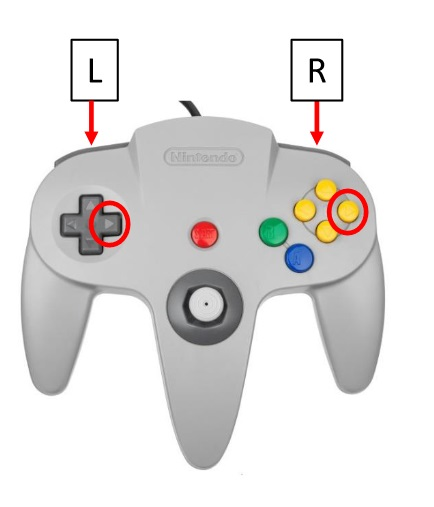
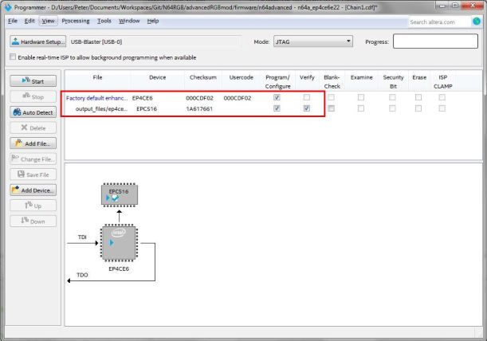
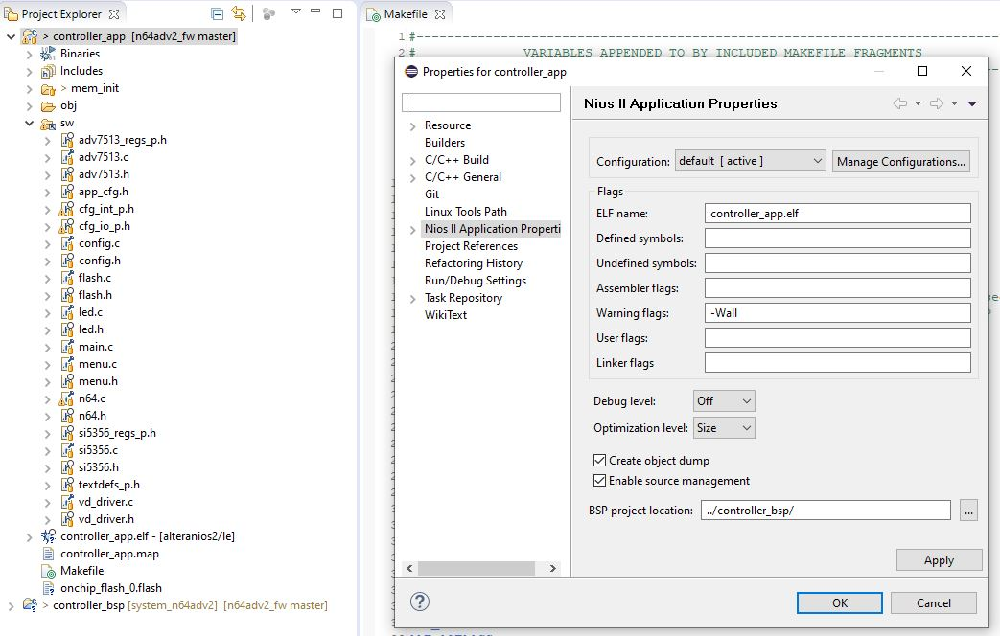

N64 Advanced (version 1)
---

### Table of Contents

- [User Information](https://github.com/borti4938/n64adv_fw#user-information)
  - [Feature Overview](https://github.com/borti4938/n64adv_fw#feature-overview)
  - [OSD Menu](https://github.com/borti4938/n64adv_fw#osd-menu)
  - [Default Configuration](https://github.com/borti4938/n64adv_fw#default-configuration)
  - [Firmware Update](https://github.com/borti4938/n64adv_fw#firmware-update)
- [Developer Information](https://github.com/borti4938/n64adv_fw#developer-information)
  - [Repository Management](https://github.com/borti4938/n64adv_fw#repository-management)
  - [Setup Toolchain](https://github.com/borti4938/n64adv_fw#setup-toolchain)
  - [Build Firmware](https://github.com/borti4938/n64adv_fw#build-firmware)

## User Information

### Features Overview

- Video DAC ADV7125 (or ADV7123)
- Automatic detection of progressive (240p/288p) and interlaced (480i/576i)
- automatic detection of NTSC and PAL mode
- VI-DeBlur in 240p/288p (horizontal resolution decreased from 640 to 320 pixels)
- 16bit color mode
- IGR features:
  - reset the console with the controller
  - quick change on VI-DeBlur and 16bit mode with the controller without accessing the menu
- Advanced features:
  - on-screen menu for configuration
  - output of RGsB or YPBPr on demand
  - linedoubling of 240p/288p video to 480p/576p
  - linetrippling of 240p to (pseudo) 720p (NTSC content only, generated resolution is not a standard resolution so compatibility highly depends on your TV)
  - Bob de-interlace of 480i/576i to 480p/576p (with optional field shift fix (reduces vertical flicker))
  - configurable hybrid scanlines
  - DeJitter for PAL in LineX2 mode \[1\]
  - possible VGA output \[2\]

\[1\] Experimental feature which might not be compatible with all PAL games. Please report incompatibilities on GitHub!  
\[2\] Not available if the filter adddon is used as HSYNC and VSYNC are shared outputs with F1 and F2 (filter selection), however VGA with CSYNC remains intact  

### OSD Menu 

#### Overview and Navigation 

The on screen display (OSD) menu can be opened at any point where a game is reading the controller by pressing **D-ri + L + R + C-ri**. (D = D-Pad)

The menu always open in the top level, where you have following options available:

- **\[Video info\]**  
  Displays some (useful) information about current video input from N64 and settings
- **\[VI configuration\]**  
  Configure the video interface
- **\[Miscellaneous config.\]**  
  Configuration related to In-Game Routines, Filter AddOn and Test-Pattern
- **\[Load/Save\]**  
  Save your current settings, load from settings or defaults
- **About...**  
  Some information on the project
- **Acknowledgment...**  
  Acknowledgement
- **License...**  
  License text

You navigate through the menu using the **D-Pad**, the **control stick** or the **C buttons**.
With up/down you go up and down, respectively, and with left/right you can change settings.
With **A** (or right) and **B** you can enter and leave a submenu.

The **\[VI configuration\]** consists of multiple pages.
You can switch between them and also the miscellaneous settings by either using the respective menu entry or by pressing **L** or **R**.

Pressing B in the top menu closes the OSD.
Alternatively, you can use **D-le + L + R + C-le** to close the menu at any point.
If you feel to just undisplay the OSD for a brief moment to check your last settings change, just hold **L + Z**.
Note that the N64Adv does not actively read the controller.
The game must read the inputs.

The following tables describe the different settings available.
The tables also show some default vaules.

#### Video-Info

| Entry | Description |
|:------|:------------|
| **PPU Feedback** | A value provided by the picture processing unit of the FPGA as feedback |
| **Video - Input** | Input resolution generated by the N64 |
| **Video - Output** | Output resolution generated by the N64Adv |
| **Video - Color depth** | Shows whether the output is generated in 21bit mode or 16 bit mode |
| **Video - Format** | RGB, RGsB or YPbPr |
| **LowRes.-DeBlur** | Shows whether low resolution deblur is enabled or not. - **off** = 640 horizontal pixel - **on** = 320 horizontal pixel |
| **Filter AddOn** | Filter cut-off frequency set by the FPGA |

#### VI configuration page 1

| Entry | Default | Description |
|:------|:--------|:------------|
| **NTSC/PAL awareness** | Global | Decide whether you want to configure linemultiplier options for both NTSC and PAL games or whether you want to apply different settings \[3\] |
| **Linemultiplier** | | Change between NTSC and PAL submenus (does not applied if NTSC/PAL awareness is off) |
| **Linemultiplier - 240p/288p settings ** | _submenu_ | Enters linemultiplier submenu for progressive video input |
| **Linemultiplier - 240p/288p settings ** | _submenu_ | Enters linemultiplier submenu for interlaced video input |
| **V/H position/timing ** | _submenu_ | Enters positioning and timing submenu |
| **Gamma Value** | 1.00 | Applies some gamma boost. Gamma curve on output is defined as I = I_{in}^**\gamma**, where I is the intensity. |
| **VI config page 2 ** | _submenu_ |  Enters VI configuration page #2 |

\[3\] If you opt for global settings, the NTSC setup is applied and showed in menu  

#### VI configuration page 2

| Entry | Default | Description |
|:------|:--------|:------------|
| **Color Space | _Default by J2_ | Selects between RGBS (RGB + separate Sync), RGBS/RGsB (RGB with sync on green) and YPbPr (Component video) (Separate sync stays enabled for all modes) |
| **Exchange R&B out** | Off | Changes outputs of R and B (Pr and Pb)\[4\] |
| **LowRes.-DeBlur ** |  | Enables low resolution deblur \[5\] |
| ** - power cycle default ** | Off | VI-DeBlur default setting after a power cycle |
| **16bit mode ** |  | Enables 16bit mode \[6\] |
| ** - power cycle default ** | Off | VI-DeBlur default setting after a power cycle |
| **V/H position/timing ** | _submenu_ | Enters positioning and timing submenu |
| **Gamma Value** | 1.00 | Applies some gamma boost. Gamma curve on output is defined as I = I_{in}^**\gamma**, where I is the intensity. |
| **VI config page 1 ** | _submenu_ |  Enters VI configuration page #1 |

\[4\] Option was introduced just for a few experimental flex cables where I exchanged red and blue  
\[5.1\] _LowRes.-DeBlur_ does not apply for interlaced content  
\[5.2\] _LowRes.-DeBlur_ applies only for progressive inputs (i.e. 240p/288p content). This improves the overall image quality if the games runs in 320x240 / 320x288. However it decreases image quality if the game uses 640 horizontal pixel.  
\[6\] In 16bit mode the color depth is reduced from standard 21bit (7bit per color) to 16bit (5bit red, 6bit green and 5bit blue) by simply cutting off the LSBs  

##### 240p/288p Configuration

| Entry | Default | Description |
|:------|:--------|:------------|
| **Enable Linemultiplier** | _Default by J4.1_ | Set the linemultiplier between **LineX Off**, **LineX2** and **LineX3** \[7\] |
| **Video PLL state** | | Shows you the state of the FPGA internal PLL \[8\] |
| **Use Scanlines** | _Default by J3_ | Choose if you want scanlines emulation be enabled for progressive content \[9\] |
| ** - Method** | _Advanced_ | Switch between **Simple** and **Advanced**.  - Simple: Reference is just a single line. - Advanced: Reference calculated by mean of previous and next pixel line. |
| ** - Scanline ID** | Even | Choose between **Even** (scanline before actual drawn line) and **Odd** (scanline after drawn line) |
| ** - Scanline Strength** \[10\] | _Default by J3_ | Selects the scanline strength with I = **s** x I_{in}, with **s** being the actual setting and I the pixel intensity. |
| ** - Hybrid Depth** \[10\] | 0% | Makes scanline strength pixel-intensity dependent - 0% means that the scanlines are drawn as calculated - 100% means that the scanlines strength is reduced down to 0 for maximum pixel intensity - above or below 100% means that the scanlines strength is reduced to 0 before maximum pixel intensity or never completely reduced to 0, respectively |

\[7.1\] At _LineX Off_ following setting won't be enabled.  
\[7.2\] _LineX3_ is only available for NTSC inputs. PAL automatically falls back to _LineX2_.  
\[7.3\] _LineX3_ does not give you a true 720p resolution as the number of lines in blanking area are too high.  
\[8\] PLL must be in **Locked** state in order that _LineX3_ is working. Otherwise _LineX3_ falls back to _LineX2_.  
\[9\] If this is _Off_, the other scanline options won't be accessable.  
\[10\] A script for simulating the scanline behavior is available under [scrips/scanline\_sim.m](./scrips/scanline_sim.m)  

Note that you can quickly skip to 480i/576i Configuration by pressing **L** or **R**.

##### 480i/576i Configuration

| Entry | Default | Description |
|:------|:--------|:------------|
| **De-Interlacing (Bob)** | _Default by J4.2_ | Enables or disables the bob deinterlacer \[11\] |
| ** - Field-Shift Fix** | Off | Shifts all fileds half of a pixel up and down between linedoubled even and odd field reducing some typicall up-down-flickering of simple bob deinterlacing in most cases |
| **Use Scanlines** | _Default by J3_ | Choose if you want scanlines emulation be enabled for interlaced content \[12\] |
| ** - Method** | _Link 240p_ | Switch between individual settings for interlaced content (**480i ind.**) or same settings as for progressive (**Link 240p.**) |
| ** - Scanline ID** | Even | Choose between **Even** (scanline before actual drawn line) and **Odd** (scanline after drawn line) |
| ** - Scanline Strength** \[13\] | _Default by J3_ | Selects the scanline strength with I = **s** x I_{in}, with **s** being the actual setting and I the pixel intensity. |
| ** - Hybrid Depth** \[13\] | 0% | Makes scanline strength pixel-intensity dependent - 0% means that the scanlines are drawn as calculated - 100% means that the scanlines strength is reduced down to 0 for maximum pixel intensity - above or below 100% means that the scanlines strength is reduced to 0 before maximum pixel intensity or never completely reduced to 0, respectively |

\[11\] At _Off_ following setting won't be enabled.  
\[12\] At _Off_ following setting won't be enabled.  
\[13\] A script for simulating the scanline behavior is available under [scrips/scanline\_sim.m](./scrips/scanline_sim.m)  

Note that you can quickly skip to 1240p/288p Configuration by pressing **L** or **R**.

##### V/H position/timing

| Entry | Default | Description |
|:------|:--------|:------------|
| **Settings for:** \[14\] | _Current_ | Selects configuration parameters between differnt modes (mode depends on NTSC/PAL, progressive/interlaced and LineX) |
| **Vertical shift** | 0 | Shifts image up (positive values) and down (negative values) \[15\] |
| **Horizontal shift** | 0 | Shifts image left (negative values) and right (positive values) |
| **DeJitter for PAL LX2** | Off | Removes line width variation in non-visible vsync area as good as possible \[16\] |
| **Reset values** | | Selects the scanline strength with I = **s** x I_{in}, with **s** being the actual setting and I the pixel intensity. |

\[14\] _Settings for_ can be changed using **L** or **R** button on the controller.  
\[15\] not available for passthrough mode  
\[16.1\] not by 100%, half of a pixel variation remains as this feature does not change the console timing at all  
\[16.2\] Experimental feature, which may not work for all games -> please report incompatibilities on GitHub!  

#### Miscellaneous

| Entry | Default | Description |
|:------|:--------|:------------|
| **In-Game Routines - Reset** | On | Enables _reset via controller_ - Button combination: **Start + Z + R + A + B** |
| **In-Game Routines - VI-DeBlur** | Off | Allows switching _low. res. deblur (see description above) **on** and **off** via controller_ - Button combination **On**: **Start + Z + R + C-ri** - Button combination **Off**: **Start + Z + R + C-le** |
| **In-Game Routines - 16bit Mode** | Off | Allows switching _low. res. deblur (see description above) **on** and **off** via controller_ - Button combination **On**: **Start + Z + R + C-down** - Button combination **Off**: **Start + Z + R + C-up** |
| **Filter AddOn - Filter Cut-Off** | Auto |  Select the filter cut-off for the filter add-on board \[17\] |
| **Show Test-Pattern ** | | Show an experimental test pattern (checkered board atm) resolution depends on actual input |
| **Unlock lucky 1440p** \[12\] | _Off_ | Unlocks 1440p resolution in the _resolution_ configuration screen |

\[17\] Jumper J1.1 has to be closed to have access to next option  

#### Save/Load/Fw.Update

| Entry | Description |
|:------|:------------|
| **Save** | Saves your current configuration to flash memory |
| **Load - Last Configuration** | Loads the setting which are stored in flash memory |
| **Load - Defaults from Jumper Set** | Loads defaults which are determined by PCB jumper settings |
| **Load - N64 Standard** | Load N64 standard setting, e.g. turn off linemultiplier. These settings are also loaded if you hold down reset button while power cycle the system. |

Note that all unsaved configuration entries in the menu are shown in yellow color.
As soon as the configuration is saved, every entry should appear in white (or grey if unavailable).

### Default Configuration

#### Boot up procedure / Fallback mode

At each power cycle, the N64Adv tries to load a valid configuration from its flash memory (U5).
In the case that this does not fail, the video processing line is setup as configured.

In the case that there is no valid configuration found, the FPGA setup certain defaults, mostly defined by Jumper settings on the PCB.
This might be the case if the configuration is corrupted or simply not present (e.g. very first boot) or if the configuration signature is incompatible to the current firmware (after a firmware upgrade over JTAG).

Even with a valid configuration in the flash memory, it is possible to default the settings.
By holding the reset button down during a power cycle, the N64Adv falls back its default configuration.

In the case that the N64Adv boots with defaults, the menu opens on that power cycle and shows a welcome screen.
The welcome screen also appears after a JTAG update if the version differs to previous version.
As soon as the user saves a certain configuration the welcome screen won't be visible anymore.

The welcome screen is determined by complile time of the software.
So if you want to sell some kits, please feel free to change the text there (file [./sw/textdefs_p.h](./sw/textdefs_p.h)) and welcome your customers with a lovely "Thank you".

### Firmware Update

#### Via JTAG

In order to update, you need to have:

- an Altera USB Blaster (or clone) for flashing the firmware
- _Quartus Prime Programmer_ software installed on your computer  
(Programmer software is offered as stand-alone application; so you don't need to have the whole Quartus Prime suite installed.)

The update procedure is as follows:
- Download the latest firmware from the [Github Repository](https://github.com/borti4938/n64adv_fw)
- Start the _Quartus Prime Programmer_ software
- Select the programmer adapter under _Hardware Setup..._ if not automatically selected
- Add the programming file with _Add File..._  
  - Programming file ends with _\*.jic_.
  - Programming file is named after the FPGA - either _n64adv\_**10cl010ye144**.jic_ or _n64adv\_**ep4ce10e22**.jic_
- Check _Program / Configure_ and _Verify_ for **EPCS16** device which should appear with the previous step.  
The FPGA be checked at _Program / Configure_ automatically.
- Click on _Start_ and wait patiently  
Please note that the **console must be turned on** in order to provide a reference target voltage for the programming device.
- Power cycle the console

## Developer Information

### Repository Management

After cloning the repository, you will find several folders.
Here is a description of what to find where.
Please note that subfolders are not necessarily outlined.

| Folder | Description |
|:-------|:------------|
| **doc** | Documentation related files (e.g. certain pictures) |
| **ip** | IP cores used by the hardware design |
| **lib** | Verilog header files and task files |
| **nios** | Basis NIOS II core design also includes IP cores used for the NIOS II system design Default path to the NIOS II software project |
| **quartus** | Relevant project and revision files for the hardware design |
| **rtl** | Verilog hardware description files |
| **scripts** | Location of all scripts and other things I used throughout the development to generate certain sources |
| **sdc** | SDC (Standard Design Constraints or Synopsys Design Constraints) files |
| **sw** | Software sources for the NIOS II soft core |

### Setup Toolchain

The following instruction does not explain how to use the certain tools and/or to manage your personal design flow.
It is meant as a first instruction how to setup the N64Adv development.

#### Software Requirements

- Quartus Prime Lite by intelFPGA (currently version 21.1) with Cyclone IV and/or Cyclone 10 FPGA device support
- NIOS II EDS
  - Windows requires Ubuntu 18.04 LTS on Windows Subsystem for Linux (WSL) in version 1 (WSL 2 is not compatible)
  - Description here uses Eclipse IDE as suggested by intelFPGA, however, other IDEs are possible, too
  - Both requires manual installation beside of Quartus Prime toolchain
  - see also _path\_to\_quartus\_installation_/nios2eds/bin/README
- Only for running \*.m scripts: MATLAB or OCTAVE

#### Hardware Description

If not already done, clone the GIT source.
Open the [project file](./quartus/n64adv.qpf) with Quartus Prime Lite.
Afterwards select the revision you like to work with; a quick switch is located in the middle of the control/symbol bar.
The revision is named after the FPGA you'd like to use / build the firmware for.

There is no explicit to build / generate IP-cores.
The IP cores based on QSYS (Platform Designer) are optional to build as this is done dynamically during synthesis. 
However, pre-building them reduces compilation time a lot and is recommended during development.

Once the IP cores are ready, you can _Compile Design_ (e.g. using the shortcut Ctrl. + L).
If everything went correct the design should compile just fine (Warnings are ok).

#### Pre-Building QSYS-IPs (Optional)

In order to pre-build the QSYS-IPs
- Open the _Platform Designer_ (Tools -> Platform Designer)
- Open one after the other (File -> Open... / Ctrl. + O):
  - ./ip/altclkctrl.qsys
  - ./nios2/system\_n64adv1.qsys
- and for each:
  - click on _Generate HDL..._, on _Generate_ and _Close_ in the pop-up windows  
  - and then on _Finish_ after the last IP

The core "altclkctrl.qsys" just need to be generated the first time you want to build the project.
You are allowed to switch between revisions without re-generating this core again.
In contrast, the NIOS II system design needs to be re-generated if the revision changes (i.e. not only the first time).
Of course, a change in any IP design needs you to re-generate the core, too.

In order to now use the pre-builds, you have to open ./quartus/n64adv\_10cl010ye144.qsf and/or ./quartus/n64adv\_ep4ce10e22.qsf, respectively.
In each file change the lines
~~~~
#qsys-ip
#set_global_assignment -name QIP_FILE ../ip/altclkctrl/synthesis/altclkctrl.qip
#set_global_assignment -name QIP_FILE ../nios/system_n64adv1/synthesis/system_n64adv1.qip

set_global_assignment -name QSYS_FILE ../ip/altclkctrl.qsys
set_global_assignment -name QSYS_FILE ../nios/system_n64adv1.qsys
~~~~
to
~~~~
#qsys-ip
set_global_assignment -name QIP_FILE ../ip/altclkctrl/synthesis/altclkctrl.qip
set_global_assignment -name QIP_FILE ../nios/system_n64adv1/synthesis/system_n64adv1.qip

#set_global_assignment -name QSYS_FILE ../ip/altclkctrl.qsys
#set_global_assignment -name QSYS_FILE ../nios/system_n64adv1.qsys
~~~~
By the time this guide was written these lines were found around 189.
Now you are using the pre-builded QSYS-IPs during synthesis.
This speeds up compalition time a lot.

#### Software Core

In Quartus Prime you have a shortcut to the NIOS II EDS.
Launch Eclipse via the menu: _Tools_ -> _NIOS II Software Build Tools for Eclipse_.
If Eclipse does not start, go back to [Software Requirements](https://github.com/borti4938/n64adv_fw#software-requirements) and follow the "NIOS II EDS" instructions.

Upon launching Eclipse you can select a workspace.
I suggest using _path\_to\_local\_git\_repo_/nios/software/.
You should be welcomed with an empty _Project Explorer_.
Follow the given instructions:

- Right-click in the _Project Explorer_ and choose _New_ -> _Nios II Application_
- In the pop-up window, you'll find a _Create..._ button which you can click on.
  This creates you a board supported package (BSP) project.
- For the Nios II BSP, setup the project as follows:
  - Project name: controller\_bsp
  - SOPC Information File name: _path\_to\_local\_git\_repo_/nios/system_n64adv1.sopcinfo  
    (must be an absolute path)
  - Check at Use default location
  - Click on _Finish_ creates you the BSP project
- Back in the Nios II Application window, a BSP location should be filled now.
  Setup the rest as follows:
  - Project name: controller\_app
  - Check at Use default location
  - Click on _Finish_ creates you the application project

Now you should have **two projects** in your Project Explorer.

##### BSP Settings

The first time you start with the softcore development, you'll need to adjust some BSP settings.
- Right-click on controller\_bsp project -> _Nios II_ -> _BSP Editor_
- Modify following settings in the _Main_ tab:
  - Select _Common_ and
    - Check _enable\_small\_c\_library_
    - Check _enable\_reduced\_device\_drivers_
    - Set _bsp\_cflags\_optimization_ to -Os
  - Select _Advanced_ and
    - Uncheck _enable\_exit_
    - Uncheck _enable\_clean\_exit_
    - Uncheck _enable\_c\_plus\_plus_
    - Check _enable\_lightweight\_device\_driver\_api_
    - Uncheck _enable\_sopc\_sysid\_check_
- Once everything is set, you can click on _Generate_ and _Exit_ the BSP Editor_

If everything is correct, there is only a need to _Generate BSP_ (Right-click on controller\_bsp project -> _Nios II_ -> _Generate BSP_) if the BSP timestamp is outdated.
The software build will let you know about that with an error.

##### Software Settings

First, we add the software sources to the project.
The you have to set the build properties.

- Import sources:
  - Right-click on the project and select _Import..._
  - Select _General_ -> _File System_ and click on button _Next >_
  - Insert _path\_to\_local\_git\_repo_/sw to _From directory_
  - Check _sw_
  - Under _Advanced_ check _Create links in workspace_
  - Click on _Finish_
- A folder named _sw_ should appear in the project folder
- Add source files to Nios II build
  - Mark all files in sw folder (usually you only need to add the c-files)
  - Right-click and select _Add to Nios II build_
- Setup application properties
  - Right-click on project folder and select _Properties_
  - Choose _Nios II Application Properties_
  - Change _Debug level:_ to _Off_
  - Change _Optimization level:_ to _Size_

From this point on you should be able to build the application project.
With the shortcut _Ctrl + F9_ (or just _F9_) you can create initialization files with the _mem\_init\_generate_ target.

If the build fails with an error in elf2dat line 2 under Windows (_cannot find /bin/sh_pl.sh_), you have to create an environment variable with following properties.
- name: `WSLENV`
- value: `SOPC_KIT_NIOS2/p`
After logging out and logging in into your account, the build should work.

### Build Firmware

Following steps are needed:
- Nios II App (if application or Nios II system has been changed)
  - Build the BSP
  - Clean controller\_app and build the app with _mem\_init\_generate_
- Hardware Design (all)
  - Run _Compile Design_ task
- Hardware Design (sw-update only)
  - Select _processing_ -> _Update Memory Initialization File_
  - Run _Assembler_ task
- Build _JIC_:
  - Open _File_ -> _Convert Programming File_
  - _Open Conversion Setup Data..._
  - Select _path\_to\_local\_git\_repo_/quartus/n64adv_ep4ce10e22.cof or _path\_to\_local\_git\_repo_/quartus/n64adv10cl010ye144.cof depending on your targeting FPGA
  - Click on _Create_ button and _Close_  
    (you may have to confirm that you want to overwrite the old file)
- Build _BIN_ for flash memory (pre-assembly programming)
  -Run the  _path\_to\_local\_git\_repo_/scripts/gen\_binary\_for\_spi.m script (MATLAB or OCTAVE needed)
